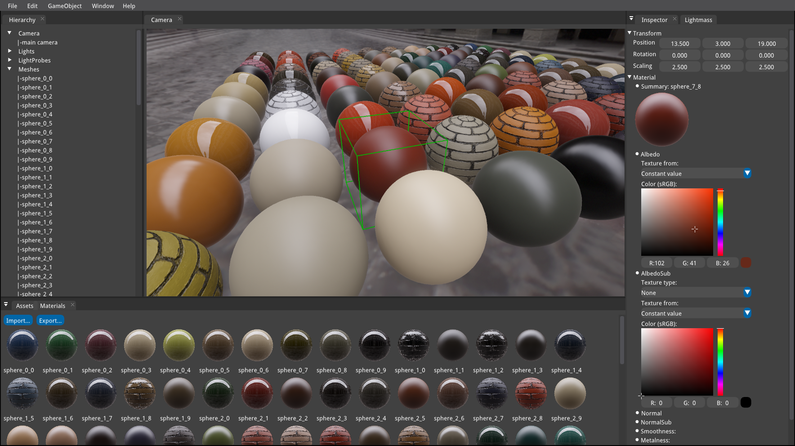

Ray3D
========

#### Cross-platform real-time rendering engine ####

The aim of the project is to create a lightweight 3D library with a very low level of complexity

[](https://raw.githubusercontent.com/ray-cast/ray/master/screenshots/screenshots.png)

### Building ###

Our build system is CMake, if you already used CMake before there is a good chance you know what to do.

```
    http://www.cmake.org
```

### License ###

Ray3D is released as Open Source under the terms of a 3-clause BSD license.

```
    http://www.linfo.org/bsdlicense.html
```

### Supported compilers:
* Clang 3.3 and above
* GCC 4.6 and above
* vs2015 and above

### Support rendering backends:
* OpenGL ES 2
* OpenGL ES 3.2
* OpenGL 3.1
* OpenGL 4.5
* Vulkan 1.0

### Supported platforms:
* ~~Android (21+, ARM, x86, MIPS)~~
* OSX (10.9+)
* Linux
* Windows (XP, Vista, 7, 8, 10)

### Engine Design:
* Data-Driven Renderer
* Physically-Based Rendering
* Practical Parallel Rendering
* Deferred Lighting
* Exponential Shadow Maps
* Image Based Lighting
* Atmospheric Scattering
* Global illumination
* Scene Space Ambient Occlusion
* Screen Space Sub Surface Scattering
* High Dynamic Range Imaging
* FXAA3
* Color Grading